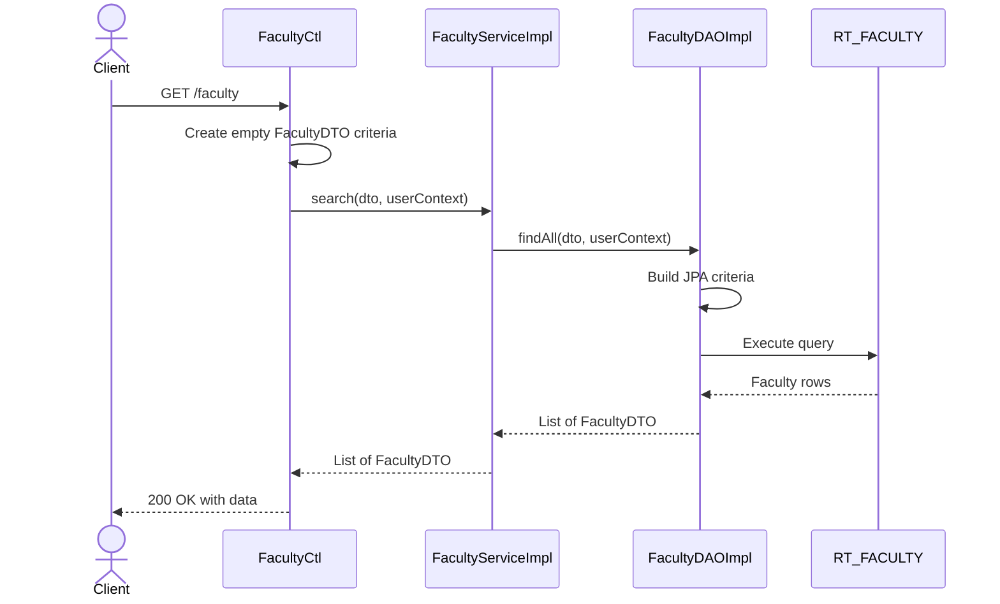
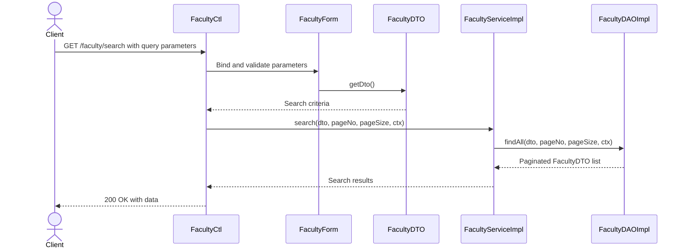
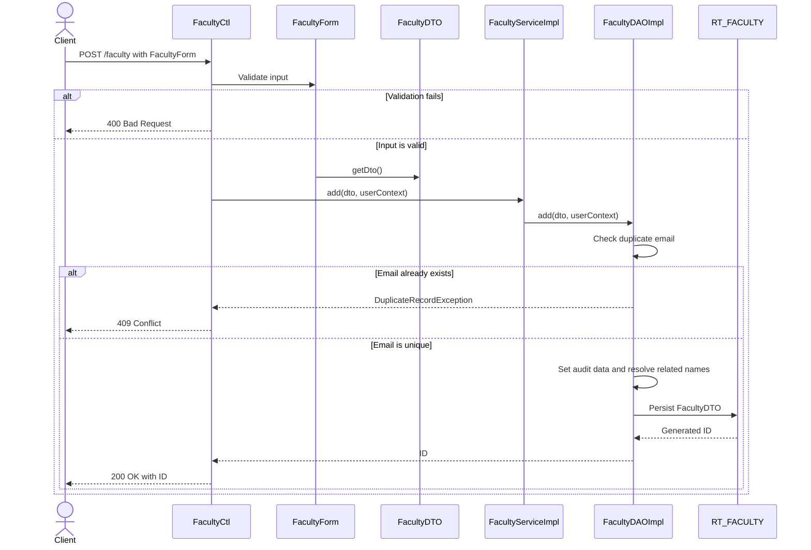
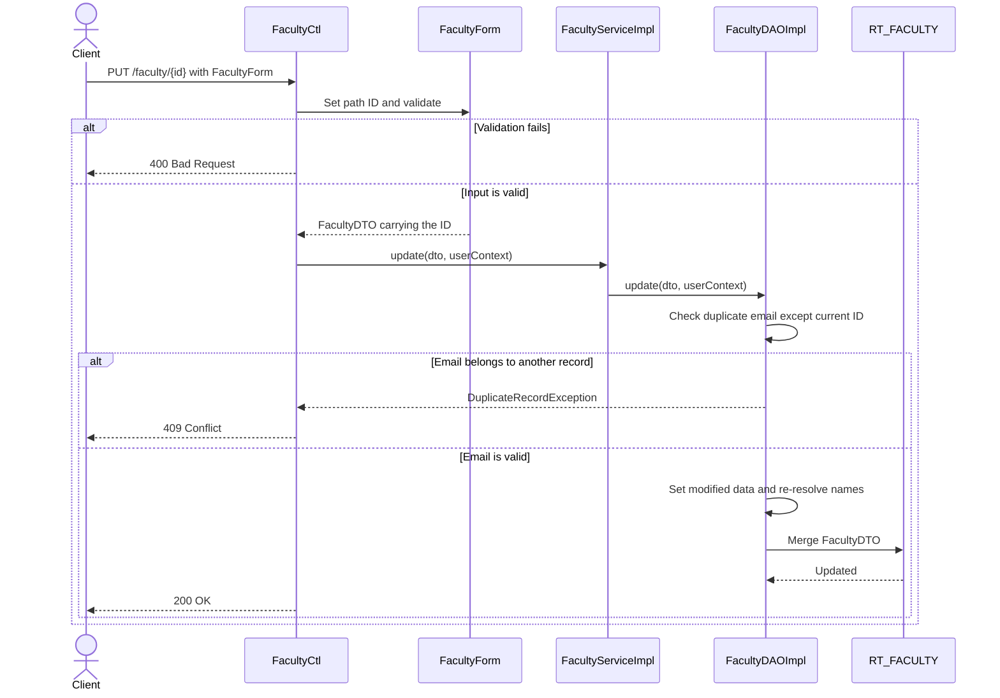
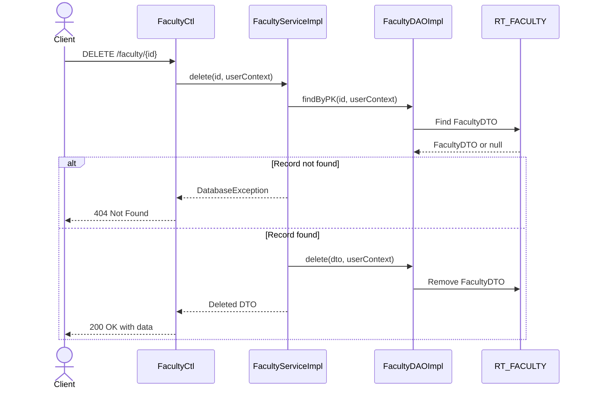
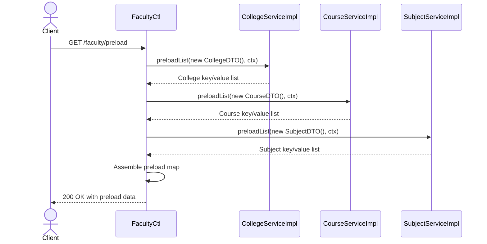

# Project 10: Faculty Architecture Implementation

This document traces what runs for each Faculty API operation—from the inherited controller methods through `FacultyForm`, `FacultyDTO`, the service layer, and the DAO to the database and back. It also highlights the routes where the standard five-class handoff does not apply.

## Architecture at a glance

| Layer | Class | Responsibility |
| --- | --- | --- |
| Controller | `FacultyCtl` | Exposes the REST endpoints, validates input, delegates work, and wraps responses. It owns `preload()` and `uploadFacultyProfilePhoto()` directly; list, search, add, update, and delete are inherited. |
| Form | `FacultyForm` | Binds and validates search, `POST`, and `PUT` input. `getDto()` maps form fields to a new `FacultyDTO`. |
| DTO / Entity | `FacultyDTO` | Represents `RT_FACULTY`; acts as search criteria on reads and as the persisted entity on writes. |
| Service | `FacultyServiceImpl` | Provides the transactional pass-through to the DAO and the faculty-specific `findByEmail()` operation. |
| DAO | `FacultyDAOImpl` | Builds JPA criteria, checks duplicates, resolves related names, and performs persistence operations. |

## API summary

| Method | Endpoint | Purpose | Uses `FacultyForm`? |
| --- | --- | --- | --- |
| `GET` | `/faculty` | List or filter faculty records | No |
| `GET` / `POST` | `/faculty/search` | Filtered and paginated search | Yes |
| `POST` | `/faculty` | Create a faculty record | Yes |
| `PUT` | `/faculty/{id}` | Replace a faculty record | Yes |
| `DELETE` | `/faculty/{id}` | Delete a faculty record | No |
| `GET` | `/faculty/preload` | Load Add/Edit dropdown data | No |

## 1. Primary trace: list faculty

### `GET /faculty`

> **Important:** `FacultyForm` and `getDto()` are not used here. A plain `GET /faculty` has no request body, so the inherited controller method creates an empty `FacultyDTO` as search criteria.

## 2. Filtered and paginated search

### `GET /faculty/search`

`FacultyForm` enters the flow on the search route because query parameters must be bound, validated, and converted into `FacultyDTO` search criteria.

## 3. Create

### `POST /faculty`

The DAO performs the duplicate check, enriches the entity, resolves college/course/subject names, and persists the record.

## 4. Update

### `PUT /faculty/{id}`

This is a full replacement flow. The path ID is applied to the form before `getDto()` creates the DTO used by the service and DAO.

## 5. Delete

### `DELETE /faculty/{id}`

> **Important:** This is the leanest trace. Neither `FacultyForm` nor an input `FacultyDTO` is required; the path ID is the complete request input.

## 6. Preload

### `GET /faculty/preload`

`preload()` is defined directly on `FacultyCtl`. It bypasses `FacultyForm`, `FacultyDTO`, `FacultyServiceImpl`, and `FacultyDAOImpl`, calling the three sibling services instead to populate the Add/Edit dropdowns.

## Response behavior

| Scenario | Expected response |
| --- | --- |
| Successful list/search | `200 OK` with faculty data |
| Successful create | `200 OK` with the generated ID |
| Successful update | `200 OK` |
| Successful delete | `200 OK` with the deleted DTO |
| Validation failure | `400 Bad Request` |
| Record not found | `404 Not Found` |
| Duplicate email | `409 Conflict` |

## Key implementation observations

- The controller, service, and DAO inherit most CRUD behavior from their base classes.
- `FacultyForm` participates only when request data must be bound and validated.
- `FacultyDTO` serves both as a JPA entity and as read/search criteria.
- Duplicate email validation is enforced in the DAO for both create and update.
- The update duplicate check must exclude the current record ID.
- Preload is a controller-orchestrated flow across the College, Course, and Subject modules.
