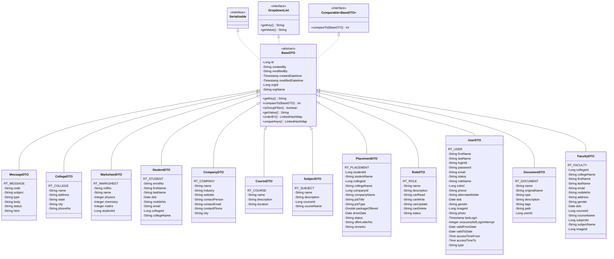

# Base Class Hierarchies

ORSProject10's layered architecture rests on three abstract bases in `com.sunilos.common`:
`BaseDTO` for persistent entities, `BaseForm` for request-bound form beans, and the
`BaseServiceInt` / `BaseServiceImpl` pair for the transactional service facade. This document
diagrams each base and everything that extends it.

Diagrams are Mermaid class diagrams (render inline on GitHub) with a PNG export alongside each
one, generated with [`@mermaid-js/mermaid-cli`](https://github.com/mermaid-js/mermaid-cli) from
the sources in [`docs/diagrams/`](docs/diagrams).

## Contents

- [BaseDTO — inheritance & members](#basedto--inheritance--members)
- [BaseDTO — what each subclass does with the contract](#basedto--what-each-subclass-does-with-the-contract)
- [BaseForm — inheritance & members](#baseform--inheritance--members)
- [Service layer — BaseServiceInt & BaseServiceImpl](#service-layer--baseserviceint--baseserviceimpl)
- [Classes outside these trees](#classes-outside-these-trees)

---

## BaseDTO — inheritance & members

Every persistent entity extends `BaseDTO`, an abstract `@MappedSuperclass` that supplies the
audit columns, org-scoping, and the dropdown/sort/uniqueness contract each subclass must
fulfil. 12 concrete entities extend it.

> **Note.** Fields such as `collegeId`/`collegeName` or `roleId`/`roleName` are denormalized
> foreign keys — a raw `Long` id plus a cached display name — not object references. There are
> no UML associations between entities here, only the shared inheritance from `BaseDTO`.

---

## BaseDTO — what each subclass does with the contract

`orderBY()` and `uniqueKeys()` are abstract on `BaseDTO` — every subclass must declare its
default sort and its natural key. `getValue()` comes from `DropdownList` and drives what shows
in select boxes built from these entities.

| Class | @Table | orderBY() | uniqueKeys() | getValue() | Notable constants |
|---|---|---|---|---|---|
| MessageDTO | RT_MESSAGE | code asc | code | code | ACTIVE/INACTIVE, EMAIL/SMS |
| CollegeDTO | RT_COLLEGE | name asc | name | name | — |
| MarksheetDTO | RT_MARKSHEET | rollNo asc | null | rollNo | — |
| StudentDTO | RT_STUDENT | firstName, lastName asc | enrolNo | firstName + lastName | — |
| CompanyDTO | RT_COMPANY | name asc | name | name | — |
| CourseDTO | RT_COURSE | name asc | name | name | — |
| SubjectDTO | RT_SUBJECT | name asc | name | name | — |
| PlacementDTO | RT_PLACEMENT | driveDate desc | null | studentName - companyName | 6 `STATUS_*` constants |
| RoleDTO | RT_ROLE | name asc | name | name | YES/NO, ACTIVE/INACTIVE |
| UserDTO | RT_USER | firstName, lastName asc | loginId | firstName + lastName | ACTIVE/DEACTIVE/LOCKED |
| DocumentDTO | RT_DOCUMENT | name asc | `{}` empty | name(type) | — |
| FacultyDTO | RT_FACULTY | firstName, lastName asc | email | firstName + lastName | — |

---

## BaseForm — inheritance & members

`BaseForm` is a plain class, not abstract — `getDto()` and `populate()` have no-op default
bodies instead of an enforced contract. Most subclasses override `getDto()` to build the
matching DTO; the three login/password forms don't, since they never construct a persistent
entity. 14 concrete forms extend it.

```mermaid
classDiagram
    direction TB

    class BaseForm {
        -Long id
        -Long[] ids
        -int pageNo
        -int pageSize
        -String operation
        #String createdBy
        #String modifiedBy
        #long createdDatetime
        #long modifiedDatetime
        +getDto() BaseDTO
        +initDTO(T) T
        +populate(BaseDTO)
    }

    class LoginForm {
        -String loginId
        -String password
    }
    class ChangePasswordForm {
        -String oldPassword
        -String newPassword
    }
    class ForgetPasswordForm {
        -String login
    }
    class CollegeForm {
        -String name
        -String address
        -String state
        -String city
        -String phoneNo
        -String message
        +getDto() BaseDTO
    }
    class StudentForm {
        -String firstName
        -String lastName
        -String dob
        -String mobileNo
        -String email
        -Long collegeId
        -String collegeName
        +getDto() BaseDTO
    }
    class CompanyForm {
        -String name
        -String industry
        -String website
        -String contactPerson
        -String contactEmail
        -String contactPhone
        -String city
        +getDto() BaseDTO
    }
    class CourseForm {
        -String name
        -String description
        -String duration
        +getDto() BaseDTO
    }
    class SubjectForm {
        -String name
        -String description
        -Long courseId
        -String courseName
        +getDto() BaseDTO
    }
    class PlacementForm {
        -Long studentId
        -String studentName
        -Long collegeId
        -String collegeName
        -Long companyId
        -String companyName
        -String jobTitle
        -String jobType
        -Double packageOffered
        -String driveDate
        -String status
        -String offerLetterNo
        -String remarks
        +getDto() BaseDTO
    }
    class RoleForm {
        -String name
        -String description
        +getDto() BaseDTO
        +populate(BaseDTO)
    }
    class DocumentForm {
        -String name
        -String type
        -String description
        -String tags
        -String path
        -Long userId
        +getDto() BaseDTO
    }
    class MarksheetForm {
        -String rollNo
        #Long studentId
        -String name
        -Integer physics
        -Integer chemistry
        #Integer maths
        +getDto() BaseDTO
    }
    class UserForm {
        -String firstName
        -String lastName
        -String loginId
        -String password
        -String email
        -String status
        -String roleName
        -Long imageId
        -Long roleId
        -String phone
        -String alternateMobile
        -Date dob
        -String gender
        -String imagePath
        +getDto() BaseDTO
    }
    class FacultyForm {
        -Long collegeId
        -String collegeName
        -String firstName
        -String lastName
        -String email
        -String mobileNo
        -String address
        -String gender
        -String dob
        -Long courseId
        -String courseName
        -Long subjectId
        -String subjectName
        -Long imageId
        +getDto() BaseDTO
    }

    BaseForm <|-- LoginForm
    BaseForm <|-- ChangePasswordForm
    BaseForm <|-- ForgetPasswordForm
    BaseForm <|-- CollegeForm
    BaseForm <|-- StudentForm
    BaseForm <|-- CompanyForm
    BaseForm <|-- CourseForm
    BaseForm <|-- SubjectForm
    BaseForm <|-- PlacementForm
    BaseForm <|-- RoleForm
    BaseForm <|-- DocumentForm
    BaseForm <|-- MarksheetForm
    BaseForm <|-- UserForm
    BaseForm <|-- FacultyForm
```

> **Note.** `MyProfileForm` and `UserRegistrationForm` (also in `com.sunilos.form`) are
> standalone classes — neither extends `BaseForm`, so neither gets paging, audit fields, or
> the `getDto()` hook.

---

## Service layer — BaseServiceInt & BaseServiceImpl

Every entity gets a matching pair: a `*ServiceInt` that extends `BaseServiceInt<T>`, and a
`*ServiceImpl` that extends `BaseServiceImpl<T, D>` and implements that interface. The base
impl supplies the full CRUD contract via an injected `D extends BaseDAOInt<T>`; subclasses only
add entity-specific finders. Dotted arrows below are interface realization (`implements`);
solid arrows are class/interface extension (`extends`).

```mermaid
classDiagram
    direction TB

    class BaseServiceInt~T~ {
        <<interface>>
        +add(T, UserContext) long
        +update(T, UserContext) void
        +save(T, UserContext) long
        +updateFields(Long, Map, UserContext) T
        +delete(long, UserContext) T
        +findById(long, UserContext) T
        +search(T, int, int, UserContext) List~T~
        +search(T, UserContext) List
        +preloadList(T, UserContext) List~Map~
    }
    class BaseServiceImpl~T~ {
        <<abstract>>
        generics: T extends BaseDTO, D extends BaseDAOInt~T~
        #D baseDao
        implements all BaseServiceInt~T~ operations
    }
    BaseServiceInt <|.. BaseServiceImpl

    class RoleServiceInt { <<interface>> +findByName(String, UserContext) RoleDTO }
    class RoleServiceImpl { +findByName(String, UserContext) RoleDTO }
    BaseServiceInt <|-- RoleServiceInt
    BaseServiceImpl <|-- RoleServiceImpl
    RoleServiceInt <|.. RoleServiceImpl

    class CollegeServiceInt { <<interface>> +findByName(String, UserContext) CollegeDTO }
    class CollegeServiceImpl { +findByName(String, UserContext) CollegeDTO }
    BaseServiceInt <|-- CollegeServiceInt
    BaseServiceImpl <|-- CollegeServiceImpl
    CollegeServiceInt <|.. CollegeServiceImpl

    class MarksheetServiceInt {
        <<interface>>
        +findByName(String, UserContext) MarksheetDTO
        +findByRollNo(String, UserContext) MarksheetDTO
        +getMeritList(UserContext) List~MarksheetDTO~
    }
    class MarksheetServiceImpl {
        +findByName(String, UserContext) MarksheetDTO
        +findByRollNo(String, UserContext) MarksheetDTO
        +getMeritList(UserContext) List~MarksheetDTO~
    }
    BaseServiceInt <|-- MarksheetServiceInt
    BaseServiceImpl <|-- MarksheetServiceImpl
    MarksheetServiceInt <|.. MarksheetServiceImpl

    class StudentServiceInt { <<interface>> +findByEmail(String, UserContext) StudentDTO }
    class StudentServiceImpl { +findByEmail(String, UserContext) StudentDTO }
    BaseServiceInt <|-- StudentServiceInt
    BaseServiceImpl <|-- StudentServiceImpl
    StudentServiceInt <|.. StudentServiceImpl

    class UserServiceInt {
        <<interface>>
        +findByLoginId(String, UserContext) UserDTO
        +authenticate(String, String) UserDTO
        +changePassword(String, String, String, UserContext) UserDTO
        +forgotPassword(String) UserDTO
        +register(UserDTO) UserDTO
    }
    class UserServiceImpl {
        -EmailServiceImpl emailService
        +findByLoginId(String, UserContext) UserDTO
        +authenticate(String, String) UserDTO
        +changePassword(String, String, String, UserContext) UserDTO
        +forgotPassword(String) UserDTO
        +register(UserDTO) UserDTO
    }
    BaseServiceInt <|-- UserServiceInt
    BaseServiceImpl <|-- UserServiceImpl
    UserServiceInt <|.. UserServiceImpl

    class CompanyServiceInt { <<interface>> +findByName(String, UserContext) CompanyDTO }
    class CompanyServiceImpl { +findByName(String, UserContext) CompanyDTO }
    BaseServiceInt <|-- CompanyServiceInt
    BaseServiceImpl <|-- CompanyServiceImpl
    CompanyServiceInt <|.. CompanyServiceImpl

    class CourseServiceInt { <<interface>> +findByName(String, UserContext) CourseDTO }
    class CourseServiceImpl { +findByName(String, UserContext) CourseDTO }
    BaseServiceInt <|-- CourseServiceInt
    BaseServiceImpl <|-- CourseServiceImpl
    CourseServiceInt <|.. CourseServiceImpl

    class SubjectServiceInt { <<interface>> +findByName(String, UserContext) SubjectDTO }
    class SubjectServiceImpl { +findByName(String, UserContext) SubjectDTO }
    BaseServiceInt <|-- SubjectServiceInt
    BaseServiceImpl <|-- SubjectServiceImpl
    SubjectServiceInt <|.. SubjectServiceImpl

    class FacultyServiceInt { <<interface>> +findByEmail(String, UserContext) FacultyDTO }
    class FacultyServiceImpl { +findByEmail(String, UserContext) FacultyDTO }
    BaseServiceInt <|-- FacultyServiceInt
    BaseServiceImpl <|-- FacultyServiceImpl
    FacultyServiceInt <|.. FacultyServiceImpl

    class PlacementServiceInt { <<interface>> no additional members }
    class PlacementServiceImpl { no additional members }
    BaseServiceInt <|-- PlacementServiceInt
    BaseServiceImpl <|-- PlacementServiceImpl
    PlacementServiceInt <|.. PlacementServiceImpl

    class DocumentServiceInt { <<interface>> no additional members }
    class DocumentServiceImpl { no additional members }
    BaseServiceInt <|-- DocumentServiceInt
    BaseServiceImpl <|-- DocumentServiceImpl
    DocumentServiceInt <|.. DocumentServiceImpl
```

> **Note.** `PlacementServiceInt`/`Impl` and `DocumentServiceInt`/`Impl` add nothing beyond the
> base contract — the generated CRUD operations are all they need.

---

## Classes outside these trees

Three classes matched earlier searches for related class names but don't participate in any of
the trees above:

- `com.sunilos.common.mail.EmailDTO` is a plain transport object (recipients, subject, body,
  attachments) that doesn't extend `BaseDTO` and is never persisted.
- `com.sunilos.form.MyProfileForm` and `com.sunilos.form.UserRegistrationForm` don't extend
  `BaseForm`.

---

*Classes referenced: `com.sunilos.common.{BaseDTO, BaseForm, BaseServiceInt, BaseServiceImpl,
BaseDAOInt, DropdownList}` · `com.sunilos.dto.*` · `com.sunilos.form.*` ·
`com.sunilos.service.*`*
