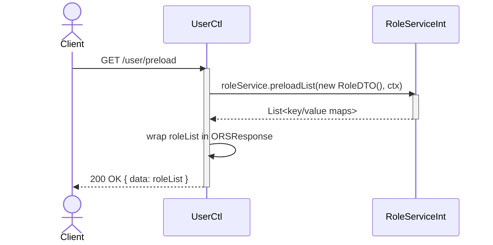
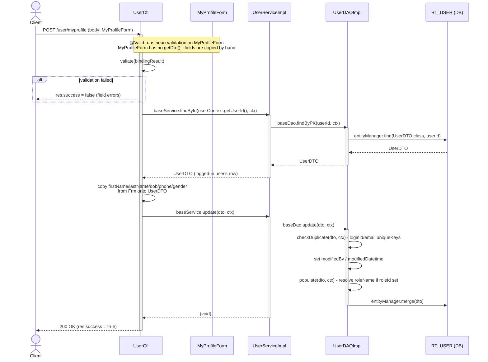
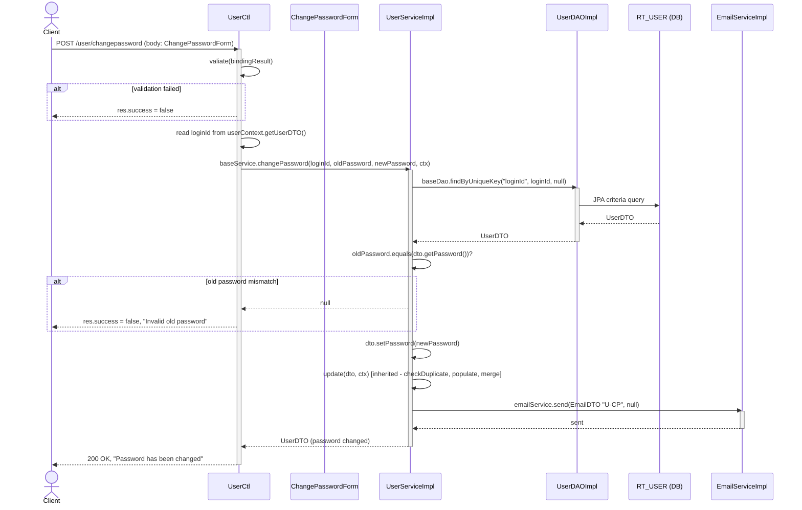
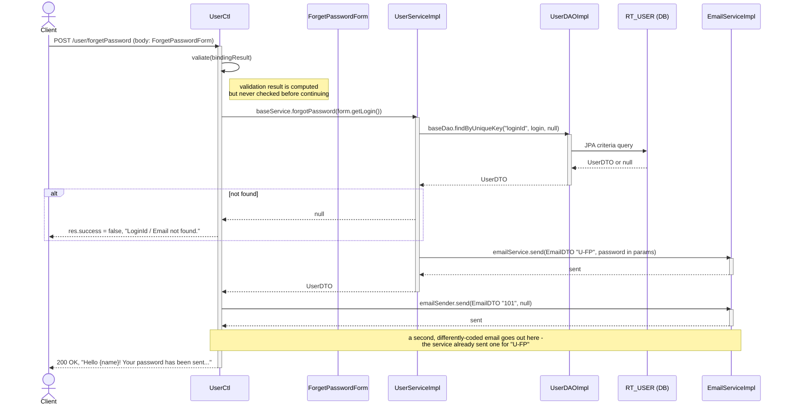
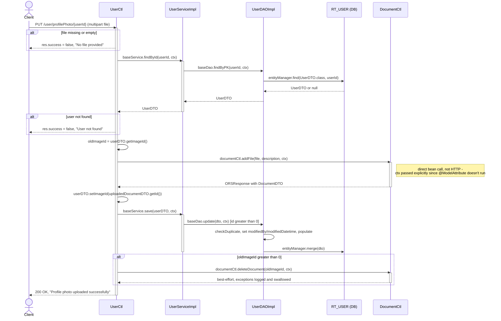
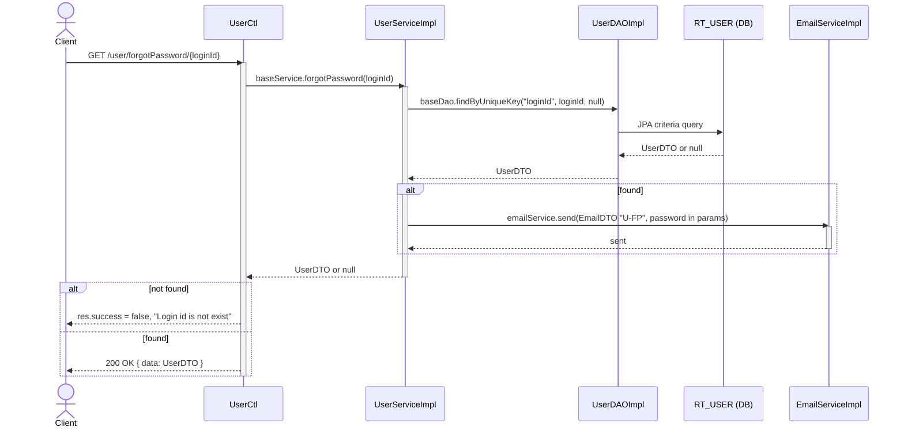

# UserCtl API Trace

`UserCtl extends BaseReportCtl<UserForm, UserDTO, UserServiceInt>`, so it inherits list /
search / add / update / delete for free. This document covers only the six endpoints
`UserCtl` declares itself — account self-service and password recovery, none of which fit
the generic CRUD shape. Each trace follows the real code path, including a couple of
behaviors worth flagging as you read them.

## Contents

- [`GET /user/preload`](#get-userpreload--role-list-for-the-user-form)
- [`POST /user/myprofile`](#post-usermyprofile--update-the-logged-in-user)
- [`POST /user/changepassword`](#post-userchangepassword)
- [`POST /user/forgetPassword`](#post-userforgetpassword)
- [`PUT /user/profilePhoto/{userId}`](#put-userprofilephotouserid)
- [`GET /user/forgotPassword/{loginId}`](#get-userforgotpasswordloginid)
- [Endpoint map](#endpoint-map)

---

## GET /user/preload — role list for the user form

**Collaborators:** `UserCtl` (the only user-specific class involved) and `RoleServiceInt`
(supplies dropdown options).

> **Note.** Mirrors `FacultyCtl.preload()`: `UserForm`, `UserDTO`, `UserServiceImpl`, and
> `UserDAOImpl` never run. This exists purely to fill the role dropdown on the add/edit user
> screen.

---

## POST /user/myprofile — update the logged-in user

**Collaborators:** `UserCtl` (fetches, hand-copies fields), `MyProfileForm` (plain bean, no
`getDto()`), `UserServiceImpl` (`findById` + `update`, both inherited), `UserDAOImpl`.

> **Note.** `MyProfileForm` doesn't extend `BaseForm` and has no `getDto()`. Unlike the
> Faculty write paths, the controller loads the existing row first and mutates it
> field-by-field — `loginId` is deliberately left untouched (the assignment line is commented
> out in source).

---

## POST /user/changepassword

**Collaborators:** `UserCtl` (validates, reads `loginId` from session context),
`UserServiceImpl` (custom `changePassword()`, not inherited), `UserDAOImpl`
(`findByUniqueKey`, then `update`), `EmailServiceImpl` ("U-CP" confirmation email).

---

## POST /user/forgetPassword

**Collaborators:** `UserCtl` (also autowires its own `EmailServiceImpl`), `UserServiceImpl`
(custom `forgotPassword()`), `UserDAOImpl` (`findByUniqueKey` lookup only),
`EmailServiceImpl` (sent from *two* places).

> **Flag.** Two things worth a second look here. `valiate(bindingResult)` is called but its
> result is never checked, so a form that fails `@Email @NotEmpty` still proceeds. And the
> plaintext password is emailed twice: once by `UserServiceImpl.forgotPassword()` (message
> code `U-FP`), then again by the controller itself with message code `101`.

---

## PUT /user/profilePhoto/{userId}

**Collaborators:** `UserCtl` (orchestrates upload, swap, cleanup), `UserServiceImpl`
(`findById` + `save`, both inherited), `UserDAOImpl`, `DocumentCtl` (called as a Java bean,
not over HTTP).

> **Note.** Structurally identical to `FacultyCtl.uploadFacultyProfilePhoto()`, same
> template: fetch entity, delegate the file to `DocumentCtl`, point the entity's `imageId` at
> the new document, save, then best-effort delete the old document.

---

## GET /user/forgotPassword/{loginId}

**Collaborators:** `UserCtl` (`@GetMapping("forgotPassword/{loginId}")`), `UserServiceImpl`
(same `forgotPassword()` as the `POST` endpoint above), `UserDAOImpl`, `EmailServiceImpl`.

> **Flag.** Two more things worth flagging. Spelling drifts between the two reset
> endpoints — `POST /user/forgetPassword` vs. `GET /user/forgotPassword/{loginId}` — easy to
> mistype when integrating against this API. And on success the response body is the full
> `UserDTO`, which carries the `password` field back to the client. The Java method is also
> literally named `myProfile` here, an overload of the unrelated method behind
> `POST /user/myprofile`.

---

## Endpoint map

| Endpoint | Collaborators beyond UserCtl |
|---|---|
| `GET /preload` | `RoleServiceInt` only. No `UserForm` / `UserDTO` / `UserServiceImpl` / `UserDAOImpl`. |
| `POST /myprofile` | `MyProfileForm` (no `getDto()`) → `UserServiceImpl.findById/update` → `UserDAOImpl`. |
| `POST /changepassword` | `ChangePasswordForm` → `UserServiceImpl.changePassword()` (custom) → `UserDAOImpl` → `EmailServiceImpl`. |
| `POST /forgetPassword` | `ForgetPasswordForm` → `UserServiceImpl.forgotPassword()` (custom) → `UserDAOImpl` → `EmailServiceImpl` × 2 (service + controller). |
| `PUT /profilePhoto/{id}` | No form. `UserServiceImpl.findById/save` → `UserDAOImpl`, plus `DocumentCtl` called directly as a bean. |
| `GET /forgotPassword/{loginId}` | No form. Same `UserServiceImpl.forgotPassword()` as the `POST` endpoint, reused from a `GET`. |

---

*Classes referenced: `com.sunilos.ctl.UserCtl` · `com.sunilos.form.{MyProfileForm,
ChangePasswordForm, ForgetPasswordForm}` · `com.sunilos.dto.UserDTO` ·
`com.sunilos.service.UserServiceImpl` · `com.sunilos.dao.UserDAOImpl` ·
`com.sunilos.service.RoleServiceInt` · `com.sunilos.ctl.DocumentCtl` ·
`com.sunilos.common.mail.EmailServiceImpl`*
